# AMS Datasource Plugin for Grafana

Use **ambari-metrics** to visualize metrics exposed via AMS in Grafana. 

*If you already have Ambari Metrics View as a part of your AMS Install, [go here](#createdash) to get started*

 - [Install Grafana](#installg)
 - [Install Datasource Plugin](#installam)
 - [Add Datasource to Grafana](#addds)
  	- [Test Datasource](#testds)
 - [Create Dashboard](#createdash)
 - [Add a Graph](#addgraph)


----------


----------
<a name="installg"></a>
### Install Grafana


You can install Grafana on any host.  It does not need to be co-located with Ambari Server.  The only requirement is that it has network access to Ambari Server.

**Install on CentOS/Red Hat:**
```
sudo yum install https://grafanarel.s3.amazonaws.com/builds/grafana-2.6.0-1.x86_64.rpm
```

**Install on Ubuntu/Debian:**
```
wget https://grafanarel.s3.amazonaws.com/builds/grafana_2.6.0_amd64.deb
sudo apt-get install -y adduser libfontconfig
sudo dpkg -i grafana_2.6.0_amd64.deb
```

**Install on SUSE/SLES:**
```
sudo rpm -i --nodeps grafana-2.6.0-1.x86_64.rpm
```
<a name="installam"></a> 
### Deploy ambari-metrics 

```
sudo wget https://github.com/prajwalrao/ambari-metrics/raw/master/dist/ambari-metrics.tar.gz
sudo tar zxvf ambari-grafana.tgz -C /usr/share/grafana/public/app/plugins/datasource
```

### Start Grafana

```
sudo service grafana-server start
```

---

<a name="addds"></a>
## Add Ambari Metrics Datasource in Grafana UI

**Add a Datasource**
>	- Click on "Datasources"
> 	- Click on "Add New" at the top 
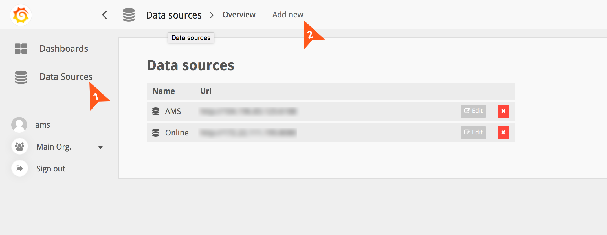

**Add a Datasource (continued)**
> 	1. Name of your Datasource
>	2. Type = AmbariMetrics
> 	3. Host+Port of your AMS installation. (usually host:6188) 
>  		- No trailing slashes
> 		- Nothing else needs to be changed
>  		- Click on Save.

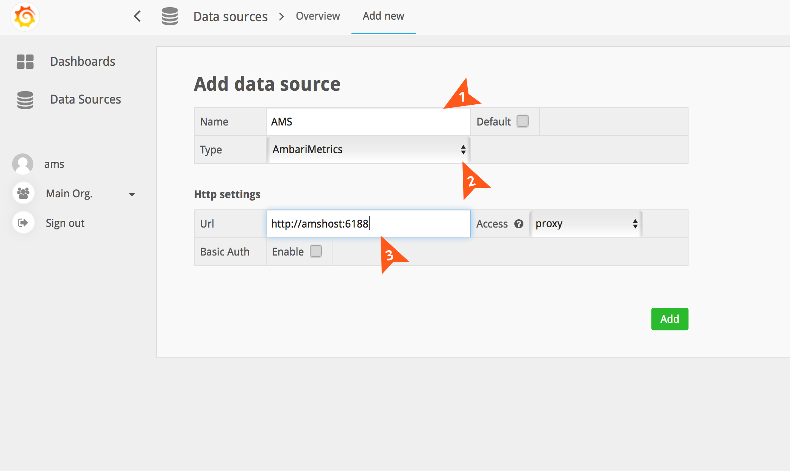


<a name="testds"></a>
**Test your Datasource**

>	To make sure it's all working, click on **Test Connection** and you should see a message that says "Data source is working". 


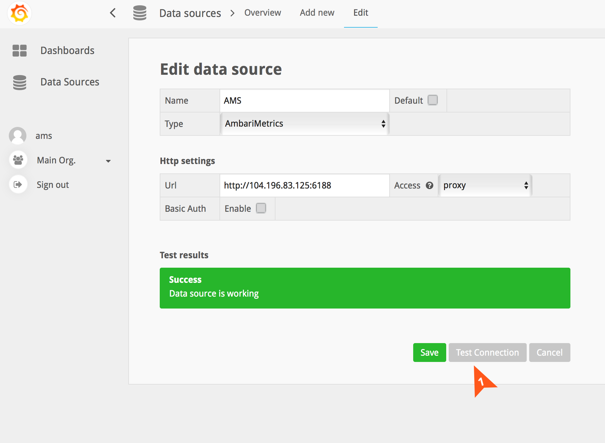

---

<a name="createdash"></a>
## Creating a Dashboard

**To create a dashboard**

>	- Click on Dashboards on the left
>	- Click on "Home"
>	- Click on New at the bottom of the dropdown 

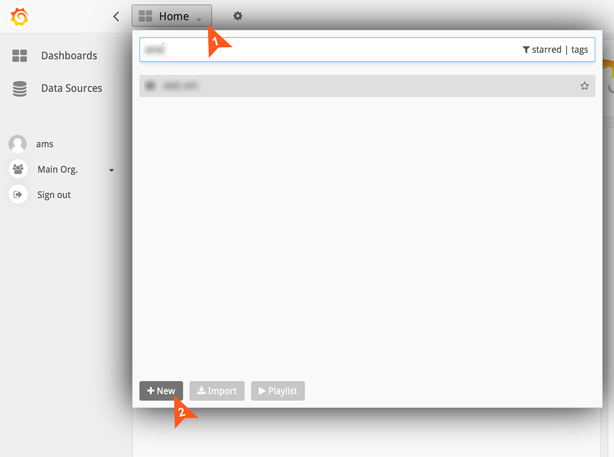


**To add a panel to your newly created dashboard**

>	- Click on the green button on the left(see image below)
>	- This will expand a flyout menu that will allow you to add a panel
>	- Choose Graph / Table / Single Stat

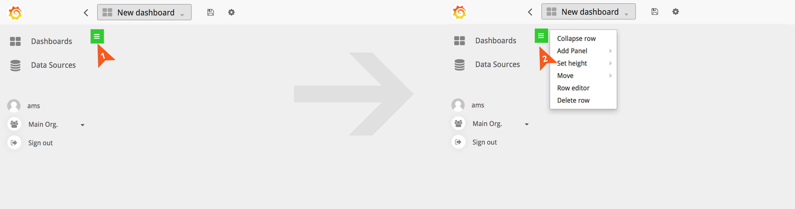

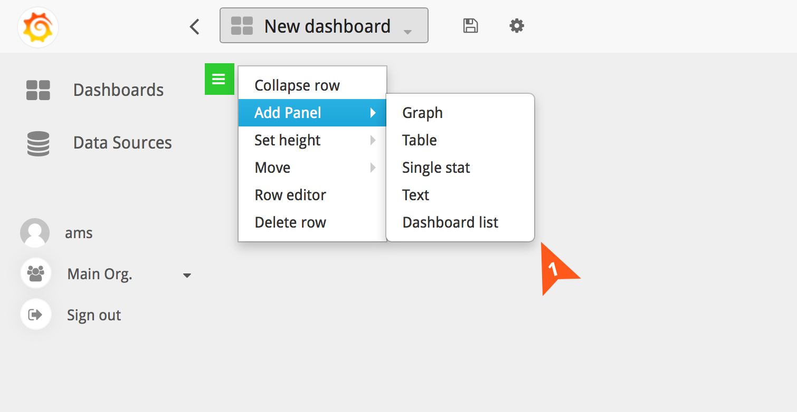


---

<a name="addgraph"></a>
**To add a Graph**


>	- Choose the Datasource you created earlier
>	- Once you've chosen the datasource, you should see the query editor show you some options

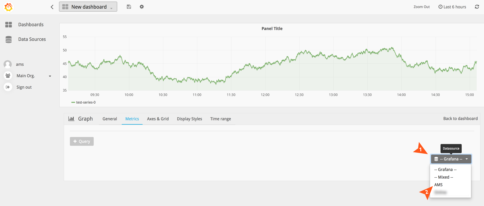


>	- Choose the component you wish to see metrics for

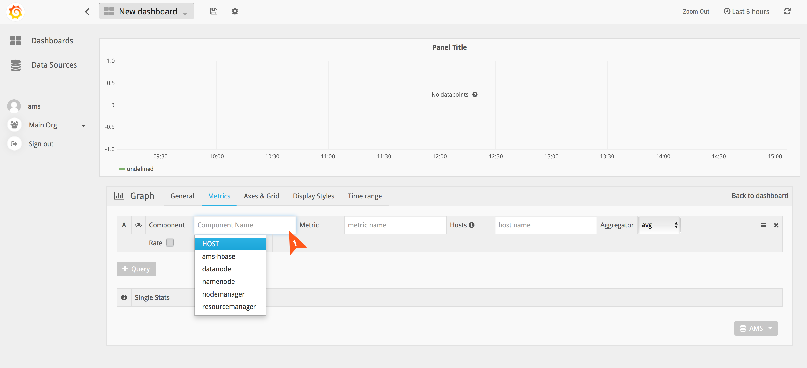


>	- Based on the component chosen, you should now see a list of metrics for it

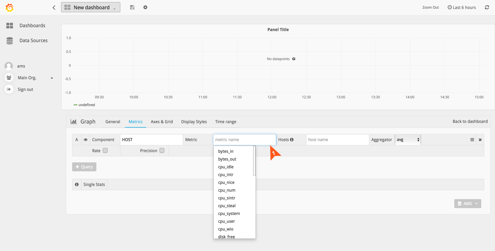


>	- Choose hostname from the list of hosts if you wish to see metrics for a specific host.
>		- if hostname isn't chosen, metrics will be shown on a service component level. 

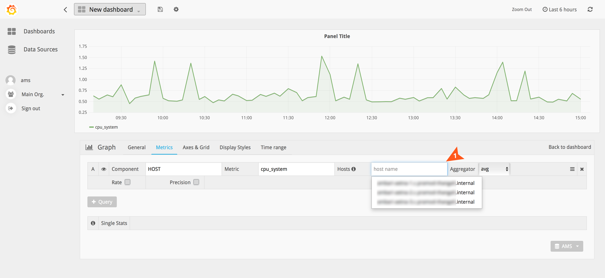


> 	- By default the aggregator is avg. You can change it via the dropdown
> 	- You can choose to enable Rate by selecting the checkbox.
> 	- You can specify precision by checking the box and then selecting "days, hours, minutes or seconds"

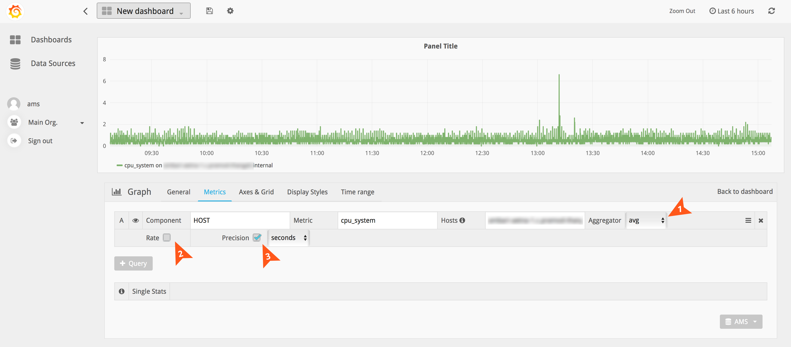


