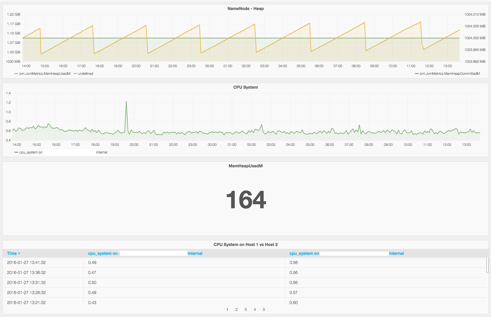

AMS Datasource Plugin for  Grafana
----------
Use **ambari-metrics** to visualize metrics exposed via AMS in Grafana. 

*This has been tested with Ambari 2.1.2/2.2.0 + HDP 2.3.*


----------


----------
Install Grafana
---------------

You can install Grafana on any host.  It does not need to be co-located with Ambari Server.  The only requirement is that it has network access to Ambari Server.

Install on CentOS/Red Hat:
```
sudo yum install https://grafanarel.s3.amazonaws.com/builds/grafana-2.6.0-1.x86_64.rpm
```

Install on Ubuntu/Debian:
```
wget https://grafanarel.s3.amazonaws.com/builds/grafana_2.6.0_amd64.deb
sudo apt-get install -y adduser libfontconfig
sudo dpkg -i grafana_2.6.0_amd64.deb
```

Install on SUSE/SLES:
```
sudo rpm -i --nodeps grafana-2.6.0-1.x86_64.rpm
```

Deploy ambari-grafana
---
```
sudo wget https://github.com/u39kun/ambari-grafana/raw/master/dist/ambari-grafana.tgz
sudo tar zxvf ambari-grafana.tgz -C /usr/share/grafana/public/app/plugins/datasource
```

Start Grafana
---
```
sudo service grafana-server start
```

Dockerized Grafana with Ambari datasource
---
Easy deployement for Docker users:
```
# create /var/lib/grafana as persistent volume storage
docker run -d -v /var/lib/grafana --name grafana-xxl-storage busybox:latest

# start grafana-xxl
docker run \
  -d \
  -p 3000:3000 \
  --name grafana-xxl \
  --volumes-from grafana-xxl-storage \
  monitoringartist/grafana-xxl
```
      
Visit [Grafana XXL project](https://github.com/monitoringartist/grafana-xxl) for more details.      


----------
